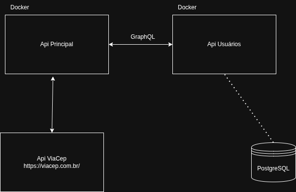

# MVP Terceira Sprint API Principal

Api que consome api externa de dados de usuários e api ViaCep para validação de endereço.

## Tecnologias utiliadas:

- Python
- FastApi
- Docker

## Fluxograma da Arquitetura




## Forma de utilizar

1. Clone o repositório
2. Acesse o diretório do projeto
3. Execute o comando
```
docker compose up --build
```

## Exemplos de uso da API GraphQL

Acessar a rota http://0.0.0.0:8000/docs e utilizar os endpoints disponíveis.